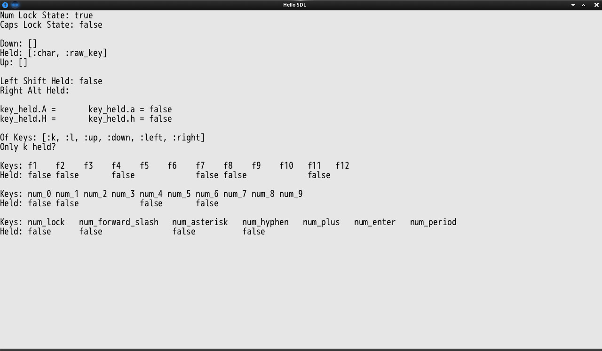

# Extra Keys
Makes a couple of edits to inputs to add extra keys and convenient methods.
  (Shouldn't break anything, I think)

## How to?
Put [`extra_keys.rb`](extra_keys.rb) somewhere and require it!

[`main.rb`](main.rb) shows example usage.

## Features
### Alterations
Get key presses for individual modifier keys e.g. `key_held.lshift` `key_down.ralt` `key_up.lctrl`

Stops modifier keys from sticking! (yay)

### Extra Keys
Use the full range of Function Keys (F1-12) e.g. `key_down.f1` `key_held.f6`

Use the num pad! `key_held.num_1` `key_up.num_hyphen`

Even use caps lock `key_down.caps_lock`

Detect whether caps lock or num lock is activated with `keyboard.caps_lock?` and `keyboard.num_lock?`

### Convenient Methods
```
keyboard.only? key, keys
  # Check if key is the only pressed key in keys

key_[down/held/up].[A-Z]
  # Check if key is pressed while shift is held
  # e.g. key_down.A
  #      key_held.B
  #      key_up.C
  # Returns either nil, false, or tick when activated
```

